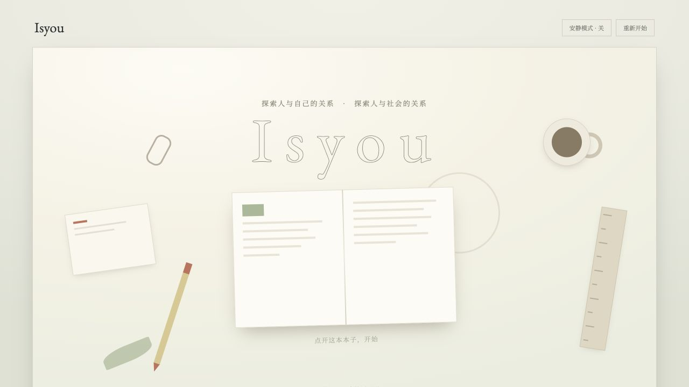
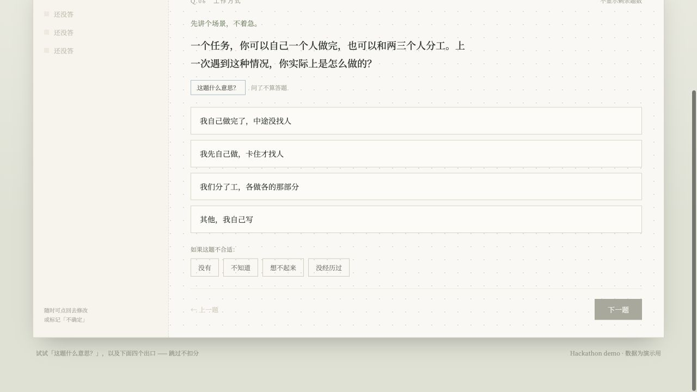
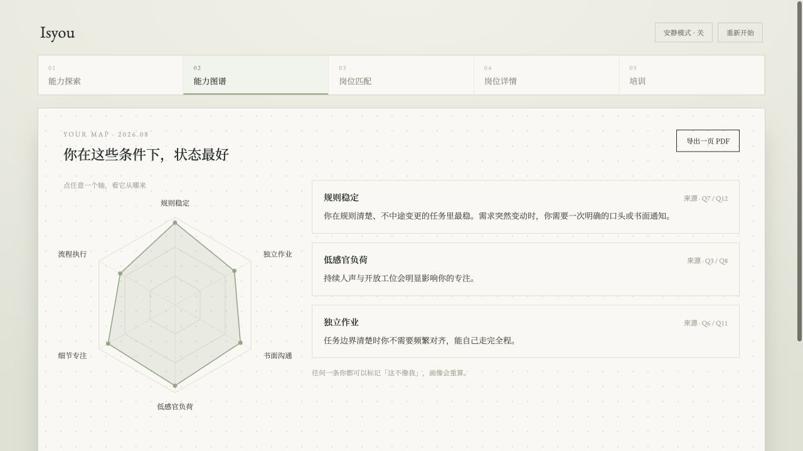
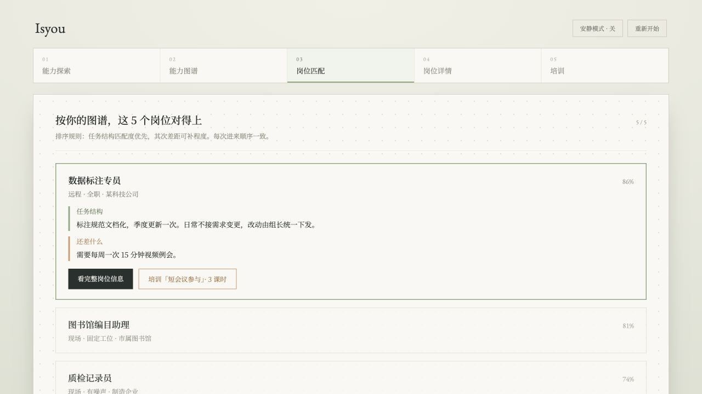
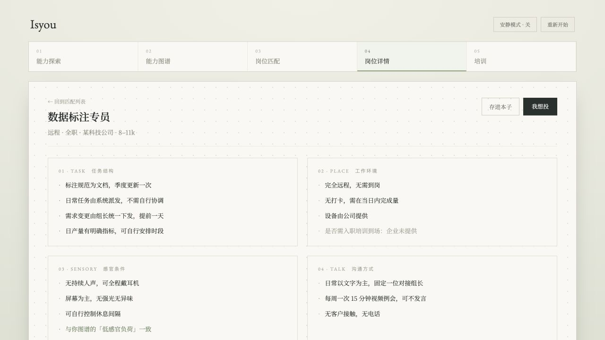
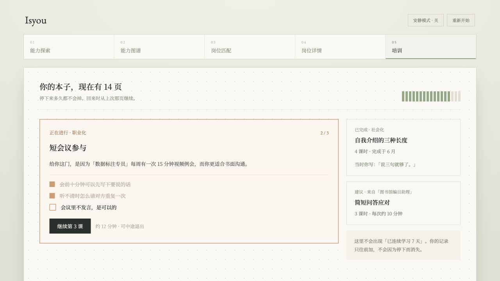

# Isyou

Isyou 是一个帮助用户理解自身能力、探索职业可能，并将方向转化为具体行动路径的 Web Demo。

## Team Preview

本仓库保持 Private，不使用公开 GitHub Pages。已获得仓库权限的团队成员可直接在本页查看当前界面，或克隆仓库体验完整交互。

本地预览：在仓库根目录执行 `python3 -m http.server 8000`，然后打开 `http://localhost:8000`。主 Demo 入口是 `index.html`，产品设计笔记是 `design-notes.html`。

## Current UI · 2026-08-28

| 欢迎页 | 能力探索 |
| --- | --- |
|  |  |

| 能力图谱 | 岗位匹配 |
| --- | --- |
|  |  |

| 岗位详情 | 培训路径 |
| --- | --- |
|  |  |

## Demo Goal

本次 Hackathon 的目标不是完成一个完整产品，而是在有限时间内跑通一条完整、可展示的核心链路。

**Demo 截止时间：Day 4 24:00**

优先级：

1. 核心链路完整可运行
2. 关键 AI 能力真实可用
3. 前端体验清晰、可展示
4. 非核心能力可以使用 mock 数据

## Core Flow

用户进入
→ 基础信息与可选信息收集
→ 用户信息结构化
→ 能力 / 兴趣识别
→ 职业方向匹配
→ 用户选择目标方向
→ 生成行动 / 训练路径
→ Web 端展示结果

## Repository Structure

* `index.html`：可交互的主 Demo
* `design-notes.html`：产品设计笔记
* `support.js` / `image-slot.js`：页面运行时支持
* `uploads/`：页面图片素材

## Current Ownership

| 模块 | 负责人 | 当前状态 |
| --- | --- | --- |
| 用户提问逻辑 | [Song Tian Xin](https://github.com/xts5210) | In Progress |
| 信息收集 Skill | [Inna](https://github.com/Inna9725) | In Progress |
| 商业化 | [LiXin](https://github.com/lixinkimkin-gif) | In Progress |
| 前端 / 设计 / 整体整合 | [Marukooo11](https://github.com/Marukooo11) | Demo Ready |

后端暂不作为独立模块分配；如 Demo 接入方案需要，再确认最小实现范围与负责人。

## Collaboration

* `main` 保持为当前可运行版本
* 多人同时开发时，各自在独立 branch 开发
* 完成后再合并回 `main`
* 不要提交 API Key、密码或其他敏感信息
* API Key 等统一放在本地 `.env`
* 新增功能前优先确认是否属于 Demo 必要链路，避免 Day 3 之后继续扩范围

## Demo Principle

**先跑通，再做漂亮；先保证完整，再补智能。**

如果某个功能无法在截止时间前稳定实现，优先使用 mock 或固定数据保证 Demo 链路完整。
